# GraMS

This repository contains the bioinformatics pipeline of the project GraMS (abbreviation from the Swedish title "Graviditet i MS").
ADD LINK TO ARTICLE.

It is structured as follows:
 - the folder RNAseq/ contains the code used for the pre-processing of RNA-seq data, it also contains the figures generated in the process
 - similarly, the folder methylation/ contains the code and the figures corresponding to the preprocessing of the methylation data
 - the folder scripts/ contains the scripts used to generate the figures in the manuscript
 - the folder figures/ contains the raw figures generated by such scripts (some aesthetical changes have been made using InkScape and SANDRA's SOFTWARE).

ADD SESSIONINFO

## Overview of data
|                          | CD4                      | CD8                      |  
| N. Samples               | Resting=68; Activated=51 | Resting=63; Activated=21 |   
| N. Individuals           | MS=11; HP=7              | MS=11; HP=7              |   
| N. Complete individuals  | MS=5; HP=4               | MS=5; HP=3               |   

We had sent 240 samples, we got back 203. Since the lost samples are randomly distributed across individuals and timepoints so it does not change the Limma pipeline. 

## Preprocessing of RNA-seq data

### Batch correction
See script RNAseq/Batch_correction.R.
The first step of our pipeline is to remove batch effects, using the R package Combat_seq (https://rdrr.io/bioc/sva/man/ComBat_seq.html), which was built precisely for RNA-seq data. 
Many factors could influence the data, such as disease, cell type, cell viability, age of the donor, etc. 
To quantify the effect of each variable, we calculate p-values that express if a given factor is very similar to a given PCA component. 


From this plot we notice that ‘Library_Batch’ has a significant p-value with respect to the second PCA, thus it is worth to adjust its effect. 
We make sure that the core of the signal (i.e., variables ‘Disease’, ‘State’ and ‘Sample_type’ in the metadata) is conserved by using the option ‘covar_mod’ in Combat_seq.  

The difference with or without batch correction is minimal, as can be seen from the next image; however, we consider more methodologically sound to keep it. 


 
### Normalization
See script RNAseq/Normalization.R.

It is important to normalize the data before doing differential analysis. In particular, we use the TMM normalization, which is part of the edgeR package (https://www.bioconductor.org/packages/release/bioc/vignettes/edgeR/inst/doc/edgeRUsersGuide.pdf). 

Before proceeding with the normalization, we convert the gene ids. The raw data is based on GENCODE annotation (e.g., ENSG00000000003.14) and contains 60.669 genes. We convert them into symbol ids (e.g., A1BG) and we sum the genes that correspond to the same symbol id. At this point we split the data into the CD4 and CD8 dataset. 

Moreover, we filter out genes that are lowly expressed by using the function filterByExpr in edgeR. In the end, we are left with 13.461 genes in CD4 and 13.456 in CD8. 

The normalization coefficients are calculated by the function calcNormFactors, following this snippet of code: 
 
```
count_tmm <- DGEList(count) 

count_tmm <- calcNormFactors(count_tmm, method="TMM") 
```
 
These coefficients will then be passed to the limma function (https://bioconductor.org/packages/release/bioc/html/limma.html).


## Preprocessing of methylation data


## Limma
Differential analysis for both methylation and RNA-seq data was performed using limma. We have used the same model for either omic; as example, we report the model used for the CD4+ RNA-seq.

```
metadata_cd4$Sample_Group <- gsub("MS_BP", "AA", metadata_cd4$Sample_Group) 
design <- model.matrix(~ Sample_Group + Proportions_Memory + Cell_Viability + Age, metadata_cd4 )
metadata_cd4$Sample_Group <- gsub("AA", "MS_BP", metadata_cd4$Sample_Group)

count_voom <- voom(count_cd4, design, plot=F)
corfit <- duplicateCorrelation(count_voom, design, block=metadata_cd4$Individual)

contr_matrix <- makeContrasts(First = Sample_GroupMS_1st_CD4 - Sample_GroupHP_1st_CD4 ,
                              Second = Sample_GroupMS_2nd_CD4 - Sample_GroupHP_2nd_CD4,
                              Third = Sample_GroupMS_3rd_CD4 - Sample_GroupHP_3rd_CD4,
                              PP = Sample_GroupMS_PP_CD4 - Sample_GroupHP_PP_CD4,
                              Second_First = (Sample_GroupMS_2nd_CD4 - Sample_GroupMS_1st_CD4) - (Sample_GroupHP_2nd_CD4 - Sample_GroupHP_1st_CD4),
                              Third_Second = (Sample_GroupMS_3rd_CD4 - Sample_GroupMS_2nd_CD4) - (Sample_GroupHP_3rd_CD4 - Sample_GroupHP_2nd_CD4),
                              Third_First = (Sample_GroupMS_3rd_CD4 - Sample_GroupMS_1st_CD4) - (Sample_GroupHP_3rd_CD4 - Sample_GroupHP_1st_CD4),
                              PP_Third = (Sample_GroupMS_PP_CD4 - Sample_GroupMS_3rd_CD4) - (Sample_GroupHP_PP_CD4 - Sample_GroupHP_3rd_CD4),
                              PP_First = (Sample_GroupMS_PP_CD4 - Sample_GroupMS_1st_CD4) - (Sample_GroupHP_PP_CD4 - Sample_GroupHP_1st_CD4),
                              Second_MS = Sample_GroupMS_2nd_CD4 - Sample_GroupMS_1st_CD4,
                              Third_MS = Sample_GroupMS_3rd_CD4 - Sample_GroupMS_1st_CD4,
                              PP_MS = Sample_GroupMS_PP_CD4 - Sample_GroupMS_1st_CD4,
                              Second_HP = Sample_GroupHP_2nd_CD4 - Sample_GroupHP_1st_CD4,
                              Third_HP = Sample_GroupHP_3rd_CD4 - Sample_GroupHP_1st_CD4,
                              PP_HP = Sample_GroupHP_PP_CD4 - Sample_GroupHP_1st_CD4,
                              Third_Second_MS = Sample_GroupMS_3rd_CD4 - Sample_GroupMS_2nd_CD4,
                              PP_Third_MS = Sample_GroupMS_PP_CD4 - Sample_GroupMS_3rd_CD4,
                              PP_Second_MS = Sample_GroupMS_PP_CD4 - Sample_GroupMS_2nd_CD4,
                              Third_Second_HP = Sample_GroupHP_3rd_CD4 - Sample_GroupHP_2nd_CD4,
                              PP_Third_HP = Sample_GroupHP_PP_CD4 - Sample_GroupHP_3rd_CD4,
                              PP_Second_HP = Sample_GroupHP_PP_CD4 - Sample_GroupHP_2nd_CD4,
                              levels=colnames(design)
)
fit_CD4 <- lmFit(count_voom , design, block=metadata_cd4$Individual, correlation=corfit$consensus)
fit_CD4 <- contrasts.fit(fit_CD4, contrasts=contr_matrix)
fit_CD4 <- eBayes(fit_CD4)
summary(decideTests(fit_CD4))
```

We then extracted comparisons of interest, such as 

```
CD4_HP_2nd_1st <- topTable(fit_CD4, p.value=Inf, lfc=0, number = "Inf", coef = "Second_HP")
```


## Figure 1: Epigenetic and transcriptomic changes follow the course of pregnancy
Figure 1 was generated by the script scripts/Figure_correlations_methyl.R and scripts/Figure_correlations_RNAseq.R.
They were later manually combined using the software Illustrator.


## Differential analysis

The approach we take with this section is to start by considering only a few variables at a time (disease, individual, timepoint) and only later we will add cell type and activation in the model. In this way we will be able to identify more clearly which variables affect the data. 


### Resting cells 

For the first analysis, we focus on resting cells. The analysis is carried out independently for the CD4 and CD8 dataset. It may appear redundant as similar observations hold for both datasets. For this reason, we will later on combine them and introduce a covariate cell type in the Limma model. 

Notice that samples P20904_249 and P20904_103 were excluded because of poor quality. 

 

**PCA plots**

We start by looking at the data ‘by eye’ with a PCA plot. 

**CD4** 

  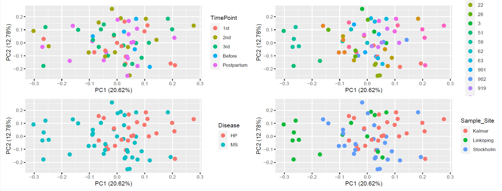

**CD8** 

  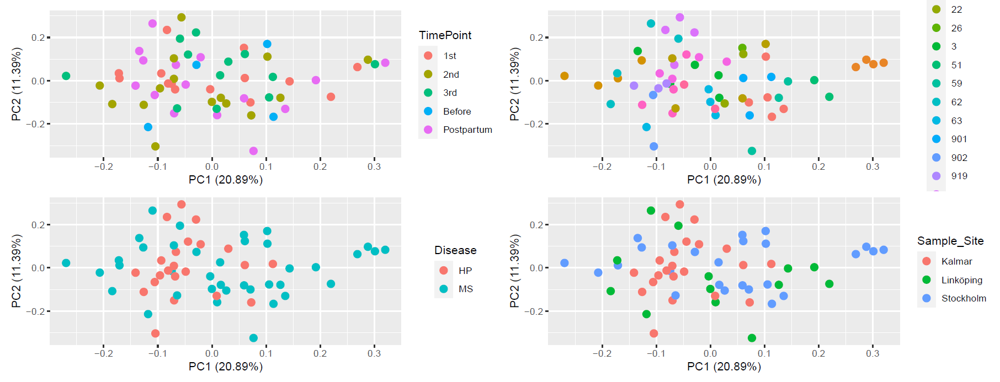


The PCA plots suggest that MS has a significant effect, especially for CD4. Then, as expected, the samples of each individual tend to cluster together. The effect of time is less evident. It is important to note that the samples cluster less with Sample_Site, as compared to the methylation data. This is a batch effect we cannot remove since it overlaps with the biological variable Disease (HP samples were gathered in Kalmar only). 

 

We now move onto differential expression analysis. We start by considering the model 
```
G = β_0 + β_1 Disease + β_2 Timepoint 
```
Where the Individual effect is blocked by the Limma function duplicateCorrelation (read here https://support.bioconductor.org/p/125489/). The idea is counting how many genes are DE in MS or in particular time points. 

 

**CD4.** The distribution of p-values of MS and 3rd trimester suggest that these two factors have a significant biological effect on the data. Arguably the same can be said about PP (PostPartum). The 2nd trimester on the other hand seems to not play a role at all in explaining the data. 

 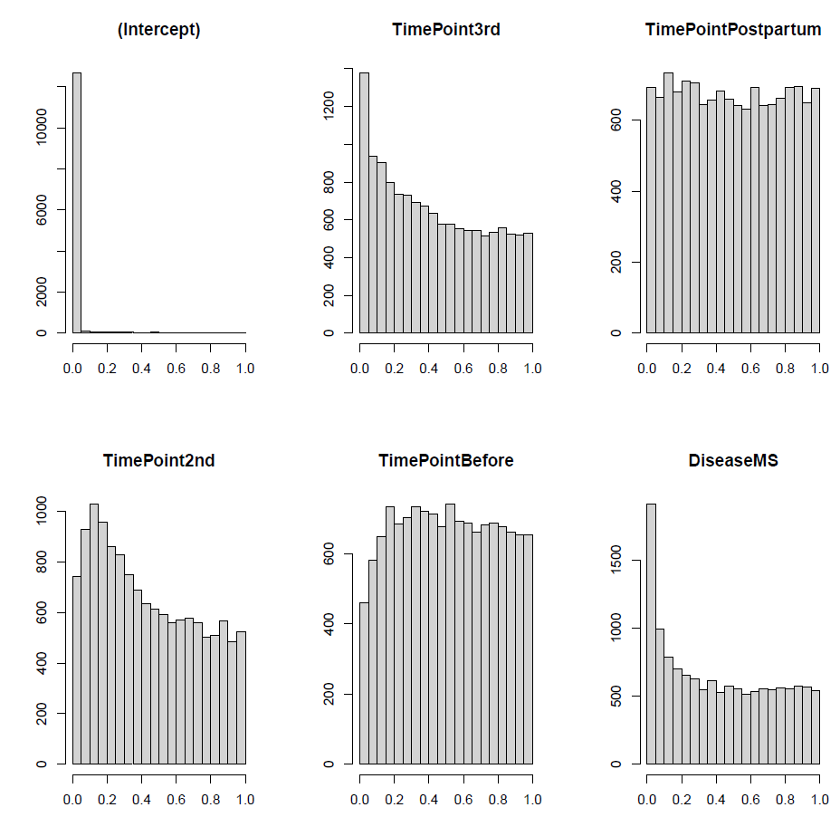

The number of DE genes that survive FDR are 78 for the 3rd semester and 71 for MS. Moreover, the genes nominally significant for both 3rd trimester and MS have a significant overlap with an independent list of MS-associated genes obtained by GWAS data (data/annotated_MS_SNPs_proc.xlsx). 

Pathway enrichment analysis of the genes with a p-value<0.01 reveals interesting pathways, as can be seen below. The pathways were corrected for the background (I.e. all the genes we measured). 

  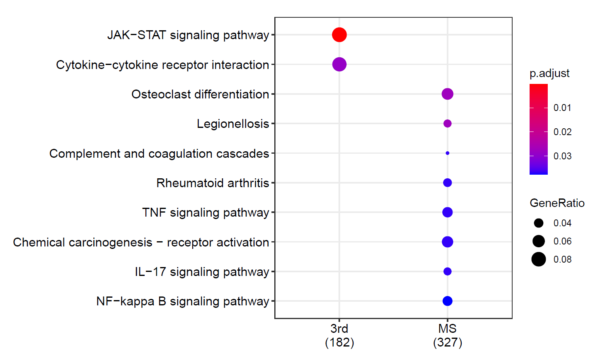

We are also interested in looking at which genes are differentially expressed between MS and HP at each timepoint. 

  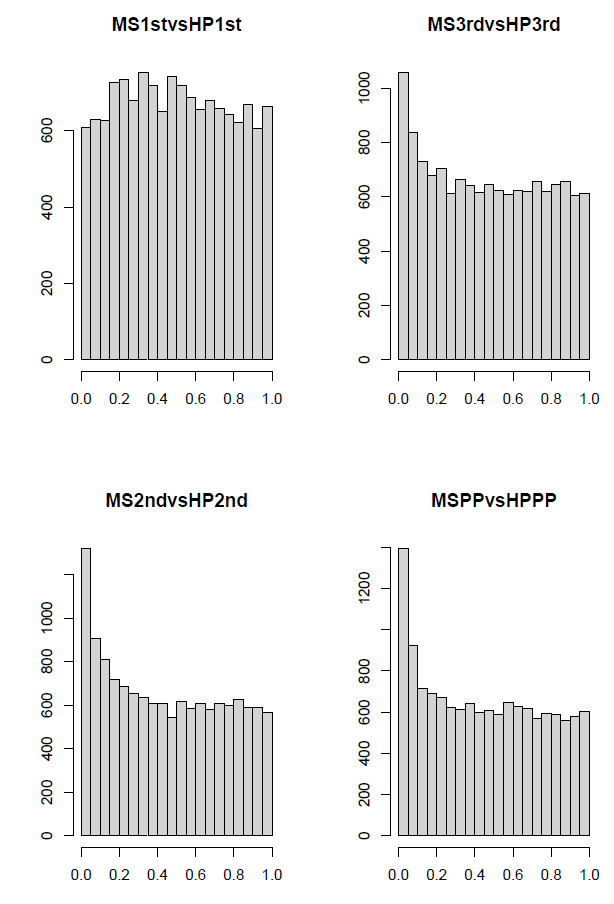


Unfortunately, no gene survives FDR. However, the nominally DE genes in the comparison at PP significantly overlap with the aforementioned list. The pathway enrichment analysis is also less striking.  

  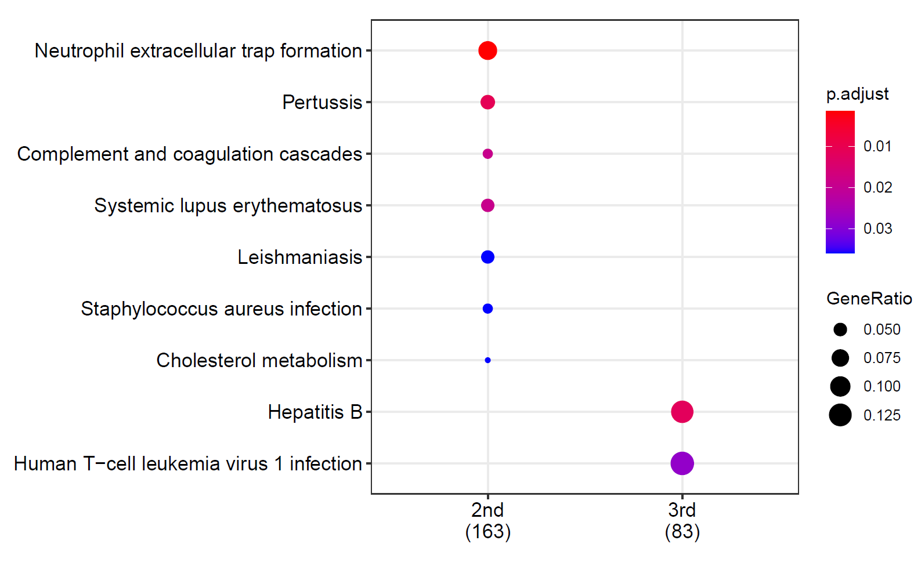


Development over time. The only significant change happens from the 3rd trimester to PP, both for HP and MS. In particular, the HP samples highlight the JAK-STAT, cytokine-cytokine, and Prolacting pathways as differentially regulated between these two timepoints; on the other hand, the MS samples reveal the JAK-STAT and NOD-like receptor signaling pathway. The majority of the genes appear to be downregulated in PP compared to 3rd trimester. 

**CD8.** Interestingly, we can make similar observations to the CD4 case: MS and 3rd are still the two factors which have a clear signal, and 2nd trimester still does not play a role. 33 genes survived FDR in the 3rd trimester and 204 in MS. As in the CD4 case, both sets of nominally significant genes were enriched for the independent list of genes aforementioned. 

 


The pathways associated with the genes with a p-value<0.01 are also interesting here. The following plot is not corrected for background; however, if we do correct, the pathways that are left are JAK-STAT and Prolacting, which confirms the importance of the 3rd semester. 

 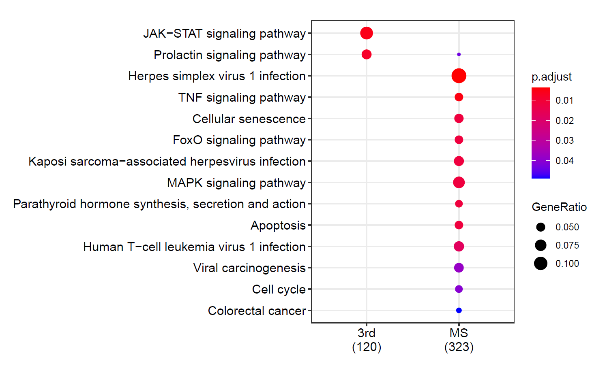


 Regarding the comparison MS versus HP, only 3 genes survive FDR in the PP comparison and, as in the CD4 case, the nominally significant genes in PP significantly overlap with the independent list. 

  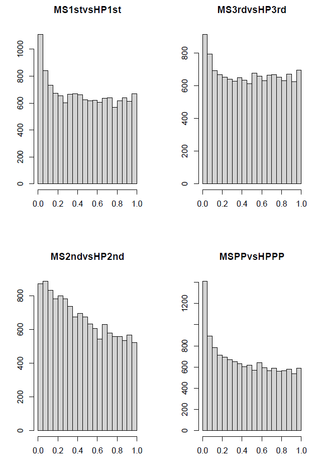


The pathways are not super interesting. 

  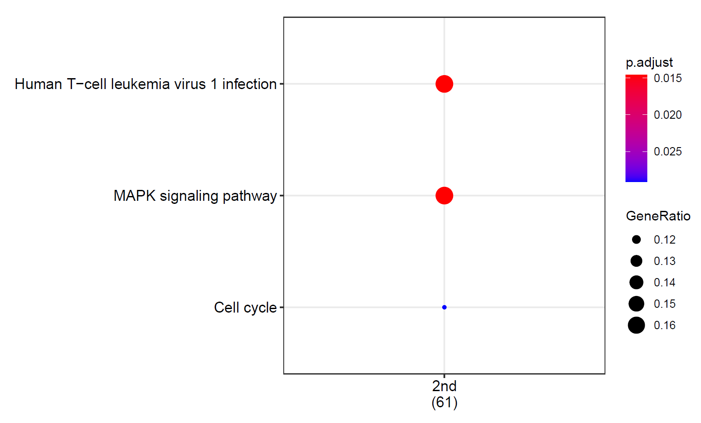
 

Development over time. In the MS samples 8 genes survive FDR (all in the comparison 3rd vs PP). What is interesting is that the top genes are connected to interesting pathways, also for the 3rd versus 2nd semester comparison. Nothing of interest came out of the HP samples.  

 

### CD4 and CD8 merged 

From these analyses, CD4 and CD8 seem to be quite similar, hence the idea of merging the two datasets and using cell type as a covariate. A quick look at the PCA shows that the samples cluster according to cell type (I.e. on the first PC), and secondarily (I.e. on the second PC) on Disease. 

 
 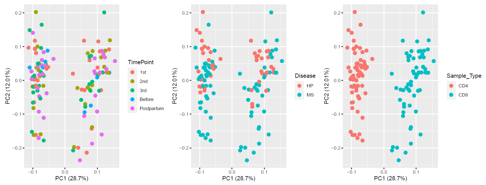


Differential analysis of the model 
```
G = β_0 + β_1 Disease + β_2 Timepoint + β_3 Sample_Type, 
```

where Sample_Type = {CD4, CD8}, shows that  
  - around 8,000 genes are DE after FDR in for cell type,  
  - 700 for disease  
  - 200 for the 3rd trimester.  

Interestingly, the nominally significant genes from the first and third list are significantly overlapping with the most list recent MS-associated genes. 

 
    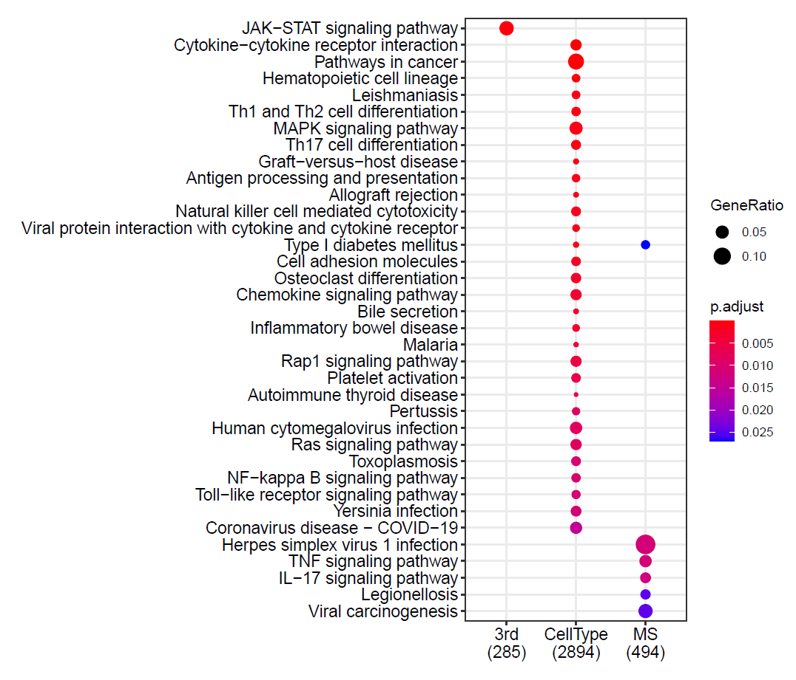

 

 

### Including Activation  

We can also try to include the activated samples in the mix. The PCA reveals a nice separation between activation (1st PC) and cell type (2nd PC). However, it is important to include cell viability as a in the model because resting cells have a significantly higher value (mean of 86 vs 70). 

 
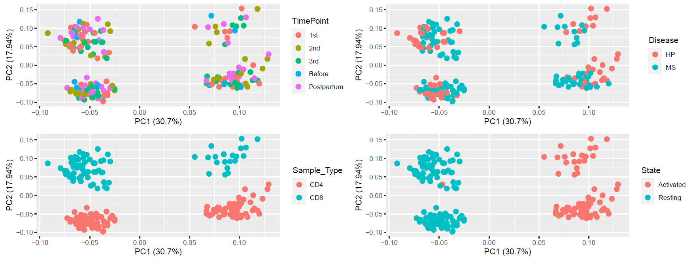

 

As usual, we continue with Limma 
```
G = β_0 + β_1 Disease + β_2 Timepoint + β_3 Sample_Type + β_4 State + β_5 Viability, 
```
Where State= {Resting, Activated}. The results after FDR are 
  - State: 10,000 
  - Cell type: 8.400 
  - Disease: 630 
  - 3rd timepoint: 77 
  - Viability: 220 

In particular, the nominally significant genes out of State, MS, 3rd trimester are enriched for the newer list of MS-associated genes. 

However, if we follow the results for pathway enrichment analysis, the most interesting genes are those in the 3rd timepoint and cell type. 

     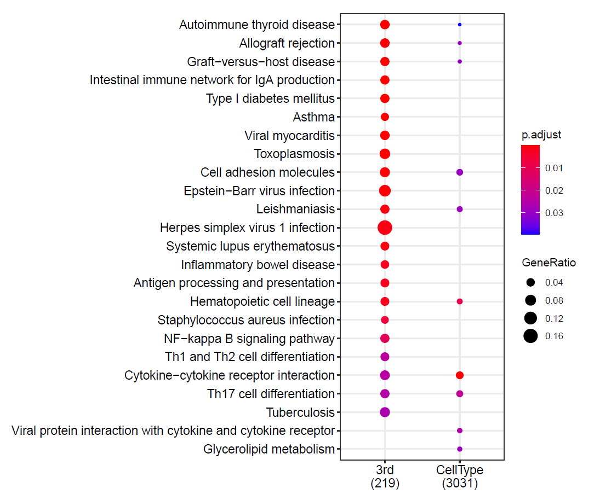


