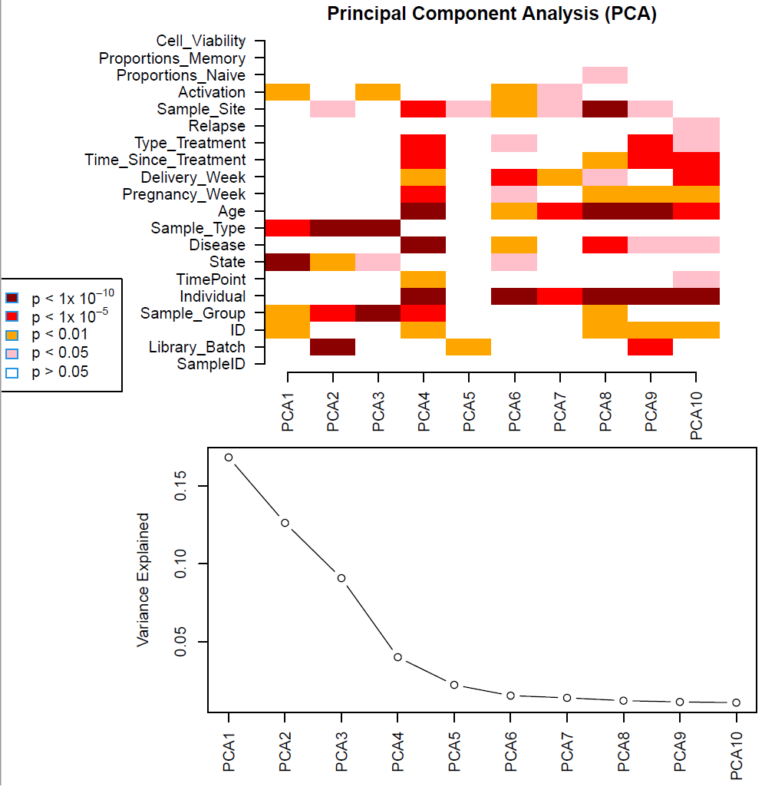

# GraMS

Description of the GraMS (graviditet in MS).


## Introduction 

This document is meant to be a journal about the RNAseq processing. 

In the first section we describe the preprocessing of the data (remove batch effects and normalize). In the second we present our differential analysis. 

 

## Preprocessing 

Remove batch effects 

Many factors could influence the data, such as disease, cell type, etc. 

To quantify the effect of each we calculate p-values that express if a given factor is very similar to a given PCA component. This plot can be found in ‘figures/pca_before_norm.pdf’. 

From this plot we notice that ‘Library_Batch’ has a significant p-value wrt the second PCA, thus it is worth to adjust its effect. 

We use Combat_seq (https://rdrr.io/bioc/sva/man/ComBat_seq.html) to do batch correction, which was built precisely for RNAseq data. 


 
During the normalization, we make sure that the core of the signal (i.e., variables ‘Disease’, ‘State’ and ‘Sample_type’ in the metadata) is conserved by using the option ‘covar_mod’ in Combat_seq.  

We check the result of the normalization in the plot ‘figures/pca_after_norm.pdf’. The difference with or without batch correction is minimal; however, we consider more methodologically sound to keep it. 

The first two components of the PCA show that State (resting or activated) is the major factor in separating the data, as can be seen from ‘figures/pca12_before_norm.pdf’ and ‘figures/pca12_after_norm.pdf’. 

## Normalization

It is important to normalize the data before doing differential analysis. In particular, we use the TMM normalization, which is part of the edgeR package (https://www.bioconductor.org/packages/release/bioc/vignettes/edgeR/inst/doc/edgeRUsersGuide.pdf). 

Before proceeding with the normalization, we convert the gene ids. The raw data is based on GENCODE annotation (e.g., ENSG00000000003.14) and contains 60.669 genes. We convert them into symbol ids (e.g., A1BG) and we sum the genes that correspond to the same symbol id. At this point we split the data into the CD4 and CD8 dataset. 

Moreover, we filter out genes that are lowly expressed by using the function filterByExpr in edgeR. In the end, we are left with 13.461 genes in CD4 and 13.456 in CD8. 

The normalization is carried out on these genes by the function calcNormFactors, following this snippet of code: 

 
```
count_tmm <- DGEList(count) 

count_tmm <- calcNormFactors(count_tmm, method="TMM") 

count_tmm <- cpm(count_tmm, log=TRUE) 
```
 

Notice that we are considering the log2(x+1) of the counts. 

## Overview of data


|   | CD4 | CD8  |  
|---|---|---|---|---|
| N. Samples   | Resting=68; Activated=51 | Resting=63; Activated=21 |   
| N. Individuals   | MS=11; HP=7 | MS=11; HP=7 |   
| N. Complete individuals  | MS=5; HP=4 | MS=5; HP=3 |   

We had sent 240 samples, we got back 203. Since the lost samples are randomly distributed across individuals and timepoints so it does not change the Limma pipeline. 

## Differential analysis

The approach we take with this section is to start by considering only a few variables at a time (disease, individual, timepoint) and only later we will add cell type and activation in the model. In this way we will be able to identify more clearly which variables affect the data. 


